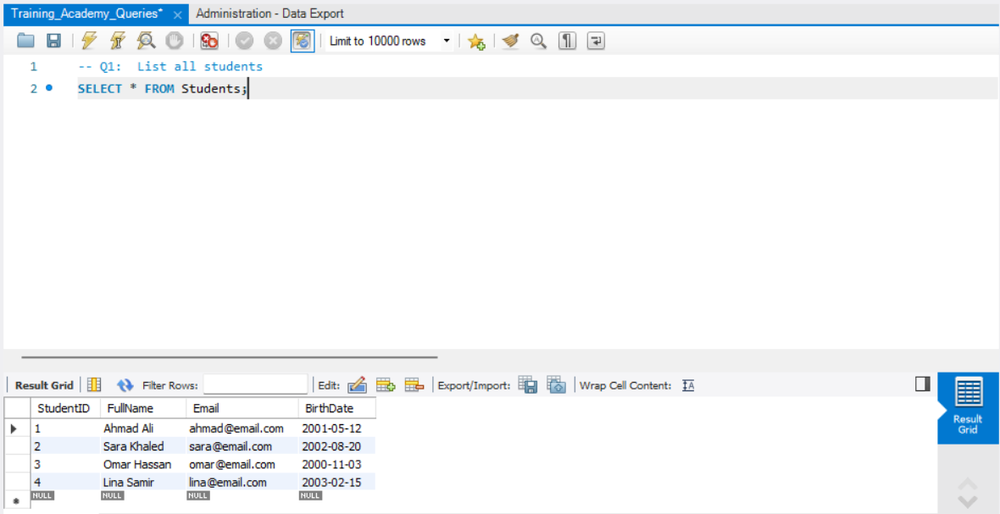
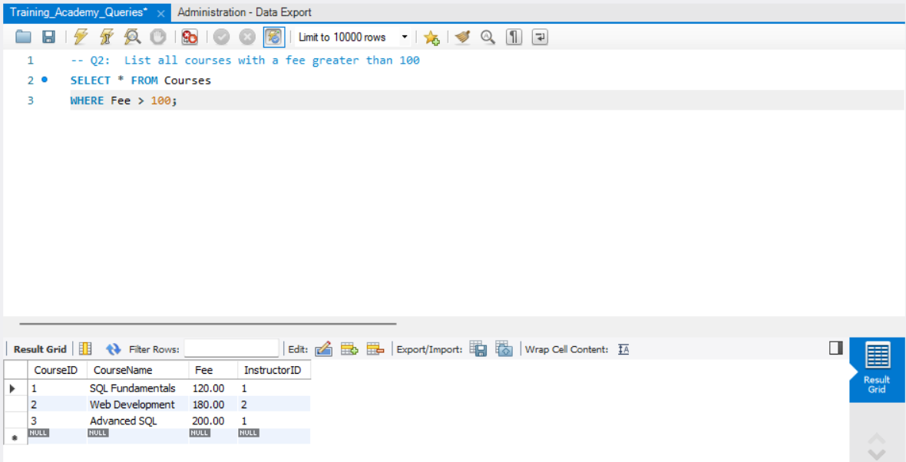
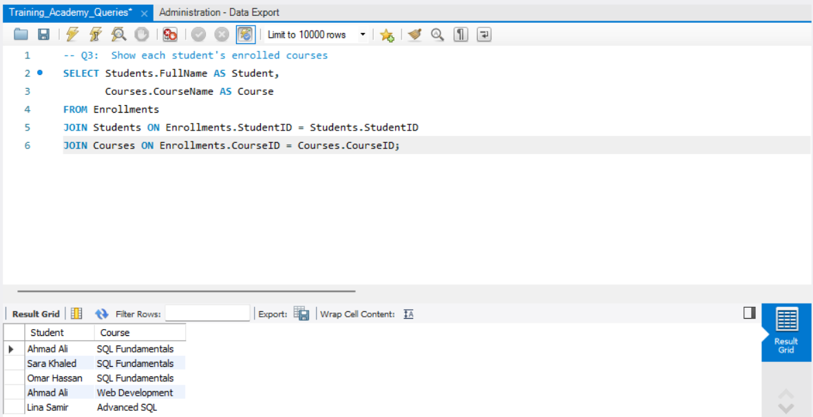
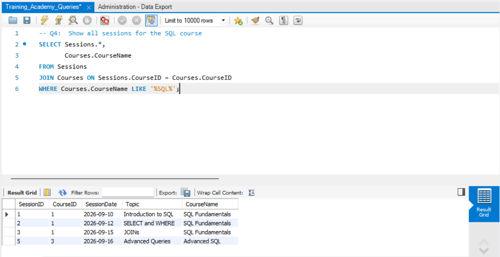
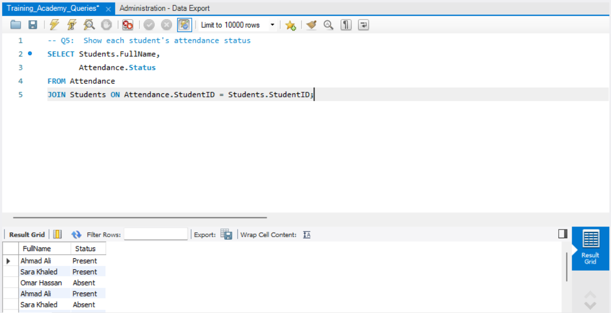
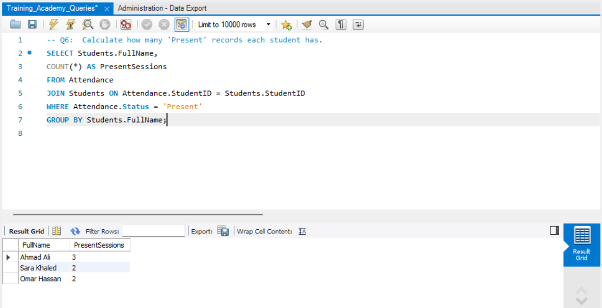
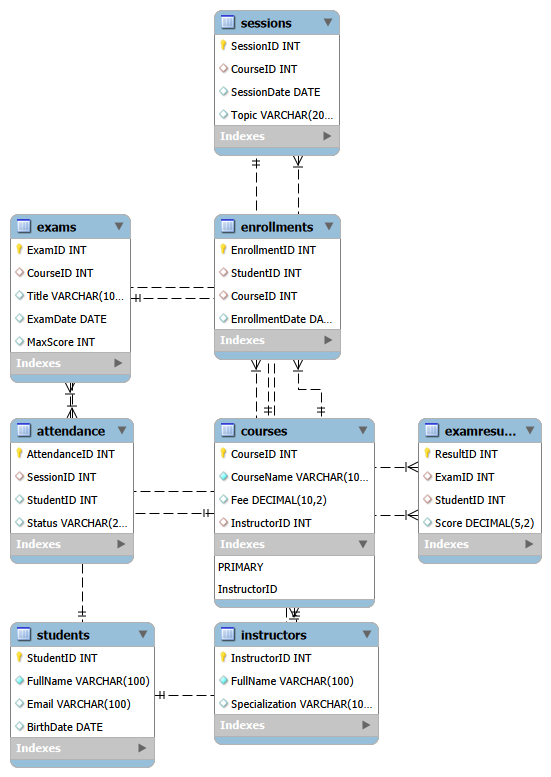

# Training Academy - SQL Database Project

## Project Overview
This project presents a comprehensive relational database system designed for a Training Academy using MySQL Workbench. It covers end-to-end database implementation including schema design, DDL and DML operations, complex JOINs, aggregate functions, and attendance tracking analytics with reporting queries.

---

## Repository Structure

| File Name | Description |
| :--- | :--- |
| `TrainingAcademy_FullExport.sql` | Full MySQL dump containing database schema and initial data records. |
| `TrainingAcademy_Workshop1.txt` | Workshop script covering DDL, DML, and foundational queries. |
| `Training_Academy_Queries.sql` | Core SQL assignment queries, filters, joins, and bonus calculations. |
| `Database_Schema.png` | Entity-Relationship (ERD) database schema diagram. |
| `screenshots/` | Folder containing step-by-step query execution output grids. |

---

## Technical Notes & DML Operations

During data maintenance and transition from test records (4rows) to official records (9rows) in the `Attendance` table, bulk DML operations (`DELETE` and `INSERT`) were utilized.
---
### Handling Safe Update Mode (Error 1175)
Because `MySQL Workbench` restricts bulk `DELETE` operations without a reference key in the `WHERE` clause to prevent accidental data loss, Safe Update Mode was handled programmatically using the following snippet:

```sql
-- Disable Safe Updates temporarily
SET SQL_SAFE_UPDATES = 0; حتى نوقف برنامج الحماية من التغييرات مؤقتا

-- Refresh Attendance Table records
DELETE FROM Attendance; نمسح الانسيرت القديم اللي كان اربعة صفوف
INSERT INTO Attendance (AttendanceID, SessionID, StudentID, Status) VALUES (...);
نضيف الانسيرت الجديد والاصلي لقاعدة البيانات 
-- Re-enable Safe Updates
SET SQL_SAFE_UPDATES = 1; نرجع نظام الحماية
```
## Key Queries & Visualizations
1. List all students


2. Courses with fee greater than 100


3. Student course enrollments


4. Sessions for SQL courses


5. Student attendance status


6. Present sessions count per student


7. Attendance percentage (BonusQuery)


## Database Architecture & Schema
- 

## Tools & Environment
- **Database Management System**: MySQL Server / MySQL Workbench
- **Language**: SQL (DDL, DML, DQL)
- **Environment**: Localhost Development Environment

## Author
**Hudhaifah Muslih Ali**
- **GitHub**: [@dandy1920](https://github.com/dandy1920)
- **Email**: dams.gard20@gmail.com
